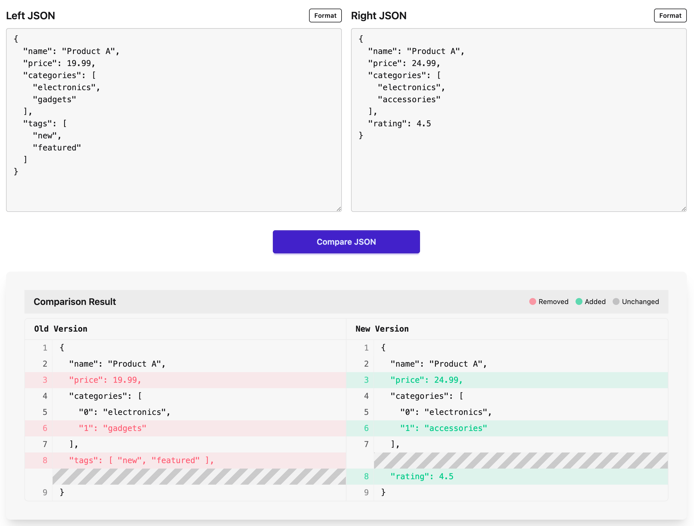

# JSONtapose

<div align="center">
  
</div>

> JSON + juxtapose

A modern, high-performance JSON comparison tool that displays differences between JSON objects in a side-by-side view.



## Features

- **Side-by-Side Comparison**: Clear visual comparison between old and new JSON versions
- **Performance Optimized**: Handles large JSON files efficiently with virtualization
- **Visual Difference Highlighting**: Color-coded changes for easy identification
- **Context-Aware Diff View**: Show only differences with configurable context lines
- **Complete JSON Display**: No abbreviation of objects or arrays
- **Deep Nested Structure Support**: Properly displays and compares nested objects and arrays
- **Theme Support**: Multiple themes including light and dark modes
- **Responsive Design**: Works on devices of all sizes
- **Google AdSense Integration**: Properly configured content-first advertising

## Quick Start

```bash
# Clone repository
git clone https://github.com/handsupmin/json-tapose.git
cd json-tapose

# Install dependencies
pnpm install

# Start development server
pnpm dev
```

## Usage

1. Enter or paste JSON in both panels
2. Click "Compare" to see the differences
3. Use the controls to:
   - Toggle between showing differences only (default) or all content
   - Adjust context lines around differences
   - Switch between different themes

## Technology

- **React 19**: Latest React version with performance improvements
- **TypeScript**: For type safety and better developer experience
- **TailwindCSS & daisyUI**: For styling and components
- **Virtualization**: Efficient rendering for large datasets
- **Context API**: For state management

## Project Structure

```
src/
├── components/     # React components
├── contexts/       # React Context for state management
├── hooks/          # Custom React hooks
├── types/          # TypeScript type definitions
└── utils/          # Utility functions including JSON comparison
```

## Development Guidelines

This project follows the [Toss Frontend Rules](./toss-frontend-rules.mdc) for consistent, maintainable code. These guidelines focus on:

- **Readability**: Using named constants, abstractions, and clear conditional logic
- **Predictability**: Standardizing return types and avoiding hidden side effects
- **Cohesion**: Organizing code by feature/domain
- **Coupling**: Minimizing dependencies between components
- **Documentation**: Following best practices for comments and documentation

### English-Only Codebase

All code, comments, and documentation in this project must be written in English. This includes:

- Variable and function names
- Code comments and JSDoc
- Documentation files (README, SPEC, etc.)
- Commit messages
- Pull request descriptions

Non-English content should only appear in user-facing text that requires localization.

## Key Optimizations

- **Component Composition**: Breaking down complex UI into focused components
- **Custom Hooks**: Separated logic for better reusability
- **Virtualized Rendering**: Only renders visible items in the viewport
- **Memoization**: Prevents unnecessary calculations and re-renders
- **Efficient Diff Algorithm**: Optimized JSON comparison with caching

## Contributing

Contributions are welcome! Please feel free to submit a Pull Request. Before contributing, please review our development guidelines and ensure all code follows our standards, including the English-only policy.

## License

This project is licensed under the MIT License.
