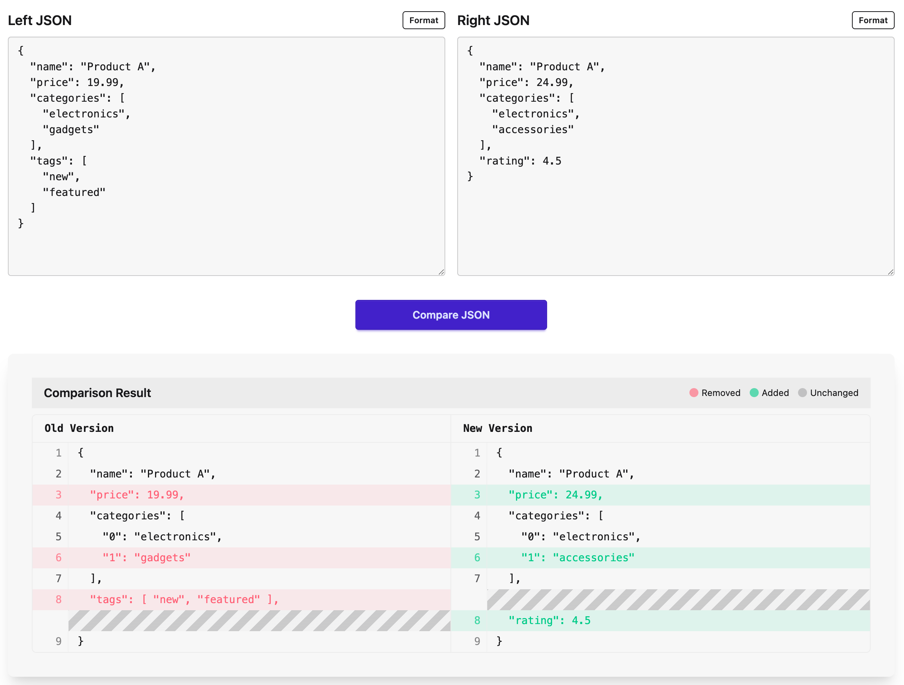

# JSONtapose

<div align="center">
  
</div>

> JSON + juxtapose

A secure, modern and high-performance JSON comparison tool that displays differences between JSON objects in a side-by-side view.

[](https://github.com/burningtree/awesome-json#online-tools)

Featured in [Awesome JSON](https://github.com/burningtree/awesome-json#online-tools), the JSON list linked from [sindresorhus/awesome](https://github.com/sindresorhus/awesome#miscellaneous). Added via [burningtree/awesome-json#229](https://github.com/burningtree/awesome-json/pull/229).



## Features

- **Side-by-Side Comparison**: Clear visual comparison between old and new JSON versions
- **Wide View Mode**: Expand comparison and tree views across the viewport while keeping a small edge gutter
- **Tree View**: Inspect JSON or structured YAML as an expandable object tree
- **Browser Extension**: Use JSONtapose from a compact browser popup with optional clipboard JSON/YAML detection
- **Desktop App**: Run JSONtapose as an Electron app with macOS menu bar and Windows system tray access
- **Performance Optimized**: Handles large JSON files efficiently with virtualization
- **Visual Difference Highlighting**: Color-coded changes for easy identification
- **Context-Aware Diff View**: Show only differences with configurable context lines
- **Complete JSON Display**: No abbreviation of objects or arrays
- **Deep Nested Structure Support**: Properly displays and compares nested objects and arrays
- **Theme Support**: Multiple themes including light and dark modes
- **Responsive Design**: Works on devices of all sizes

## Quick Start

```bash
# Clone repository
git clone https://github.com/handsupmin/json-tapose.git
cd json-tapose

# Install dependencies
pnpm install

# Start development server
pnpm dev
```

## Builds and Artifacts

Builds are visible in **GitHub Actions**:

- **Azure Static Web Apps CI/CD** deploys the hosted web app from `main`. This workflow is for the website only.
- **Build Installables** builds and uploads operator-facing artifacts:
  - `web-dist`: static web build from `dist`
  - `browser-extension-unpacked`: unpacked Chrome/Edge extension from `dist-extension`
  - `desktop-macos-arm64`: macOS Apple Silicon DMG
  - `desktop-macos-x64`: macOS Intel DMG
  - `desktop-windows-installer-x64`: Windows x64 NSIS installer
  - `desktop-windows-portable-x64`: Windows x64 portable executable

To make a fresh build without pushing a new commit, open **Actions -> Build Installables -> Run workflow**. Artifacts appear at the bottom of the completed workflow run.

## Installation

### Web App

The web app is deployed by the Azure Static Web Apps workflow when changes land on `main`.

For a local production preview:

```bash
pnpm install
pnpm build
pnpm preview
```

### Browser Extension

From GitHub Actions:

1. Open **Actions -> Build Installables**.
2. Download `browser-extension-unpacked`.
3. Unzip it.
4. In Chrome or Edge, open `chrome://extensions` or `edge://extensions`.
5. Enable **Developer mode**.
6. Click **Load unpacked** and select the unzipped folder that contains `manifest.json`.

For a local extension build:

```bash
pnpm install
pnpm build:extension
```

Then load the `dist-extension` directory as an unpacked extension.

Clipboard detection is off by default. When enabled in the popup, it detects structured JSON or YAML and normalizes it into formatted JSON for the active tool.

### Desktop App

From GitHub Actions:

1. Open **Actions -> Build Installables**.
2. On macOS, download `desktop-macos-arm64` for Apple Silicon or `desktop-macos-x64` for Intel.
3. On Windows, download `desktop-windows-installer-x64` for the installer or `desktop-windows-portable-x64` for a portable executable.
4. Unzip the artifact.
5. Install or run the downloaded DMG or executable.

Local packaging:

```bash
pnpm install
pnpm desktop:pack
```

`desktop:pack` creates unpacked local builds under `release/`, which are best for smoke testing. For release-style installers, prefer the **Build Installables** workflow because it builds on native macOS and Windows runners.

Desktop behavior:

- macOS: closing the window hides it and keeps JSONtapose available from the menu bar. Click the menu bar icon to show or hide the window. Right-click for the Open/Hide and Quit menu.
- Windows: closing or minimizing hides the window and keeps JSONtapose available from the system tray. Use the tray icon or context menu to reopen or quit.

Unsigned macOS builds from local packaging or GitHub Actions artifacts may require right-clicking the app and choosing **Open** the first time. Production distribution should add Apple and Windows signing credentials before public release.

## Operator Runbook

Use this checklist before handing a build to someone else:

```bash
pnpm install
pnpm lint
pnpm test
pnpm build
pnpm build:extension
pnpm build:desktop-main
```

Desktop smoke test on macOS:

```bash
CSC_IDENTITY_AUTO_DISCOVERY=false pnpm desktop:pack
open -n release/mac-arm64/JSONtapose.app
```

Confirm that:

- The app opens without a blank screen.
- Closing the window leaves the process running in the menu bar.
- The menu bar or tray control can reopen the window.
- Quit from the tray/menu bar exits the process.

For Windows, use the `desktop-windows` artifact from GitHub Actions and confirm that the tray icon appears, Open/Hide works, and Quit exits the app.

## Usage

1. Enter or paste JSON in both panels
2. Click "Compare" to see the differences
3. Use the controls to:
   - Toggle between showing differences only (default) or all content
   - Adjust context lines around differences
   - Switch between different themes

## Technology

- **React 19**: Latest React version with performance improvements
- **TypeScript**: For type safety and better developer experience
- **TailwindCSS & daisyUI**: For styling and components
- **Electron**: Desktop packaging and tray/menu bar integration
- **Vite**: Web, desktop renderer, and extension builds
- **Virtualization**: Efficient rendering for large datasets
- **Context API**: For state management

## Project Structure

```
.github/
└── workflows/      # Web deploy and installable artifact builds
electron/           # Electron main/preload process
extension/          # Browser extension manifest and popup HTML entry
src/
├── components/     # React components
├── contexts/       # React Context for state management
├── extension/      # Browser extension React popup code
├── hooks/          # Custom React hooks
├── types/          # TypeScript type definitions
└── utils/          # Utility functions including JSON comparison
```

## Key Optimizations

- **Component Composition**: Breaking down complex UI into focused components
- **Custom Hooks**: Separated logic for better reusability
- **Virtualized Rendering**: Only renders visible items in the viewport
- **Memoization**: Prevents unnecessary calculations and re-renders
- **Efficient Diff Algorithm**: Optimized JSON comparison with caching

## Development Guidelines

This project follows strict development guidelines to maintain code quality and consistency:

### Code Style

- Use TypeScript for all new code
- Follow ESLint and Prettier configurations
- Write meaningful commit messages
- Keep functions small and focused
- Use meaningful variable and function names

### Best Practices

- Document complex logic with comments
- Keep components pure and reusable
- Use proper error handling
- Follow React best practices and hooks guidelines

### English-Only Policy

- All code, comments, and documentation must be in English
- Variable and function names must be in English
- Commit messages must be in English
- Only user-facing text can be localized

## Contributing

1. Fork the repo
2. Create a branch (`git checkout -b feature/amazing-feature`)
3. Commit your changes
4. Open a Pull Request
5. Read [CONTRIBUTING.md](CONTRIBUTING.md) for detailed guidelines

## License

This project is licensed under the MIT License.
